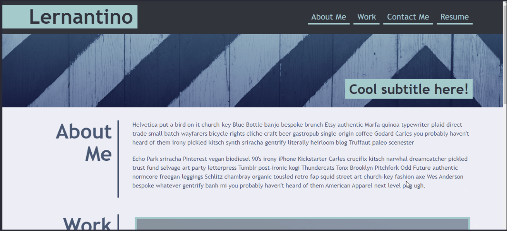

# challenge-2

## Description
```
Create a portfolio of work samples for potential employers to review samples of work for an open position.
```

## Visuals
```
The following images shows a mock-up demo of the portfolio.




```

## Installation
```
*Create a new remote repository in github with a README.md file.
*Clone the HTTPS url on gitbash to your local repository. 
*Navigate to the repository in your local branch. 
*Create an index.html and style.css to start coding.
```

## Roadmap
```
I will be updating the page with actual work once complete.
```

## Deployed Application Link
```

```

## Author & Contributors
```
@thoak90codes
```