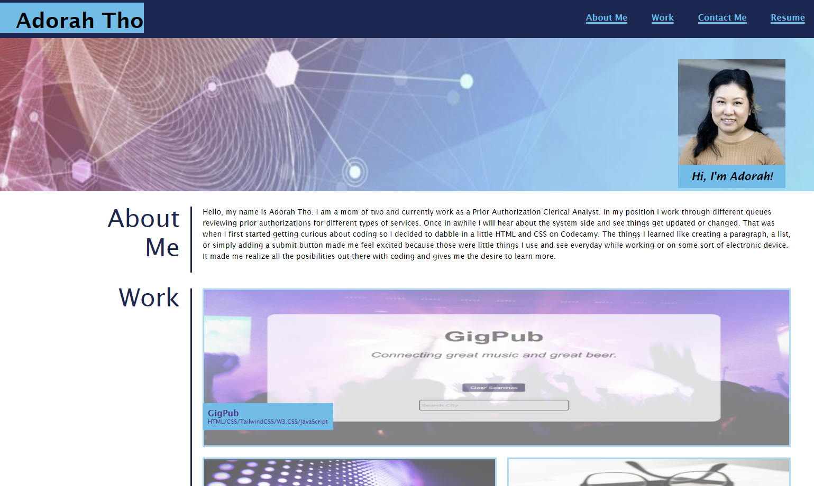

# portfolio

## Description

Create a portfolio of work samples for potential employers to review samples of work for an open position.

## Visuals

## Installation

 - Create a new remote repository in github with a README.md file.
 - Clone the HTTPS url on gitbash to your local repository. 
 - Navigate to the repository in your local branch. 
 - Create an index.html and style.css to start coding.

## Roadmap

I will be updating the page with actual work once complete.

4/20/2023 - Updated work with image and link to GigPub.

## Deployed Application Link

https://thoak90codes.github.io/portfolio/

## Author & Contributors

UW Coding Bootcamp
 @thoak90codes
